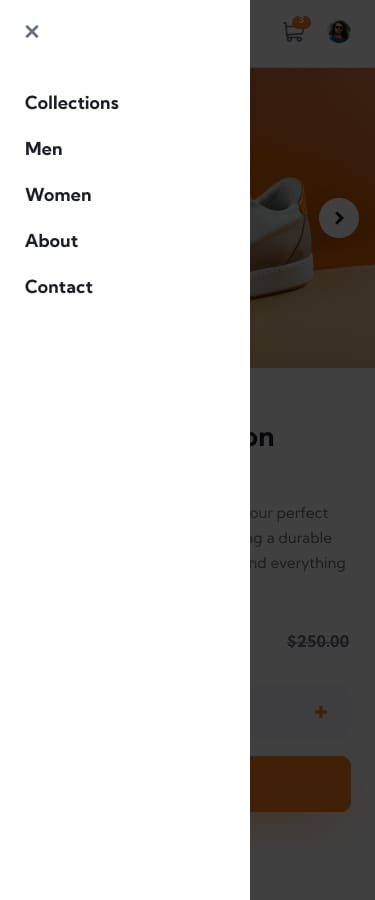

# Frontend Mentor - E-commerce product page solution 🛍️

This is a solution to the [E-commerce product page challenge on Frontend Mentor](https://www.frontendmentor.io/challenges/ecommerce-product-page-UPsZ9MJp6). Frontend Mentor challenges help you improve your coding skills by building realistic projects.

## Table of contents

- [Overview](#overview)
  - [The challenge](#the-challenge)
  - [Screenshot](#screenshot)
  - [Links](#links)
- [My process](#my-process)
  - [Built with](#built-with)
  - [What I learned](#what-i-learned)
  - [Continued development](#continued-development)
  - [Useful resources](#useful-resources)
- [Author](#author)
- [Acknowledgments](#acknowledgments)

## Overview

### The challenge 🎯

Users should be able to:

- View the optimal layout for the site depending on their device's screen size 📱💻
- See hover states for all interactive elements on the page 🖱️
- Open a lightbox gallery by clicking on the large product image 🖼️
- Switch the large product image by clicking on the small thumbnail images 🔄
- Add items to the cart 🛒
- View the cart and remove items from it ❌

### Screenshot 📸

#### Desktop Preview


#### Desktop Cart-filled Preview


#### Mobile Preview


#### Mobile Cart-filled Preview


#### Desktop Menu Preview


### Links 🔗

- Live Site URL: [E-commerce product page](https://e-commerce-product-page-tau-inky.vercel.app/)

## My process

### Built with 🛠️

- Semantic HTML5 markup
- CSS custom properties
- Flexbox
- CSS Grid
- Mobile-first workflow
- Vanilla JavaScript

### What I learned 🧠

Use this section to recap over some of your major learnings while working through this project. Writing these out and providing code samples of areas you want to highlight is a great way to reinforce your own knowledge.

```html
<h1>Some HTML code I'm proud of</h1>
```
```css
.proud-of-this-css {
  color: papayawhip;
}
```
```js
const proudOfThisFunc = () => {
  console.log('🎉')
}
```

### Continued development 🚀

In future projects, I want to focus on:

- Improving my JavaScript skills, particularly in managing complex state
- Enhancing my CSS animations and transitions
- Implementing accessibility features
- Exploring CSS preprocessors like SASS

### Useful resources 📚

- [MDN Web Docs](https://developer.mozilla.org/) - Comprehensive resource for HTML, CSS, and JavaScript.
- [CSS-Tricks](https://css-tricks.com/) - Great articles and guides for CSS techniques.

## Author 👨‍💻

- Website - [Abdullah](https://social-links-profile-rose-mu.vercel.app/)
- LinkedIn - [LinkedIn](https://www.linkedin.com/in/abdullah-a-2940b7260/)
- Frontend Mentor - [Abdullah](https://www.frontendmentor.io/profile/Ayyubiy90)
- Twitter - [Abdullah](https://www.twitter.com/ayyubiy10)
- Instagram - [Abdullah](https://www.instagram.com/ayyubiy_10)

## Acknowledgments 🙏

A special thank you to Frontend Mentor for providing this challenge. I also appreciate the community for their inspiration and support!